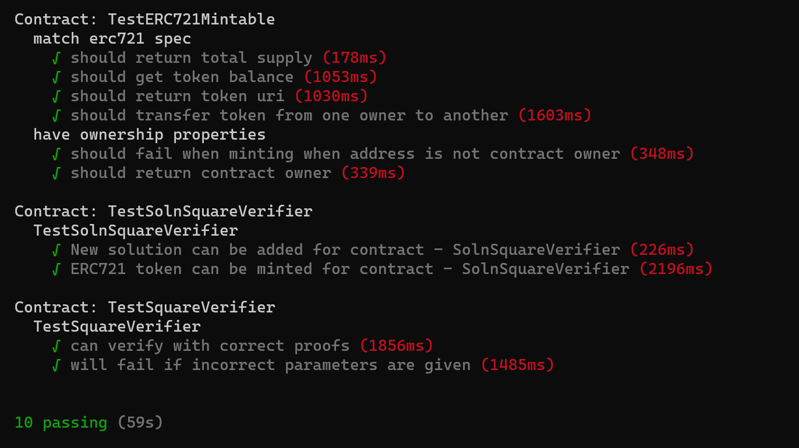
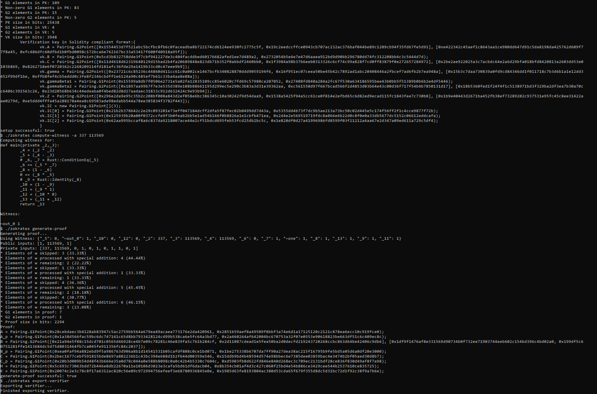

# Udacity Blockchain Capstone

The capstone will build upon the knowledge you have gained in the course in order to build a decentralized housing product. 

## content

 
 

## Truffle
    Truffle v5.1.13 

## Solidity
    Solidity v0.4.25 (solc-js) 

## Web3
    web3 1.2.1 

## Node
    v12.16.3

## 
     contract address: 0xDE09C1a49e715BCa3cDe39C9DB924C6f46Fc87Ff
     SolnSquareVerifier transaction hash: 0x714e2ff40422eb7cd1121bb08a4253577b380f3f7ff0f62cc13aa93a960919de
     SolnSquareVerifier contract: 0xDE09C1a49e715BCa3cDe39C9DB924C6f46Fc87Ff
     https://rinkeby.etherscan.io/address/0x4e2d91d2babb80a83c88fd1b545a15da6322918c
     https://testnets.opensea.io/collection/realstatecapstone-houses-v1

# Project Resources

* [Remix - Solidity IDE](https://remix.ethereum.org/)
* [Visual Studio Code](https://code.visualstudio.com/)
* [Truffle Framework](https://truffleframework.com/)
* [Ganache - One Click Blockchain](https://truffleframework.com/ganache)
* [Open Zeppelin ](https://openzeppelin.org/)
* [Interactive zero knowledge 3-colorability demonstration](http://web.mit.edu/~ezyang/Public/graph/svg.html)
* [Docker](https://docs.docker.com/install/)
* [ZoKrates](https://github.com/Zokrates/ZoKrates)
